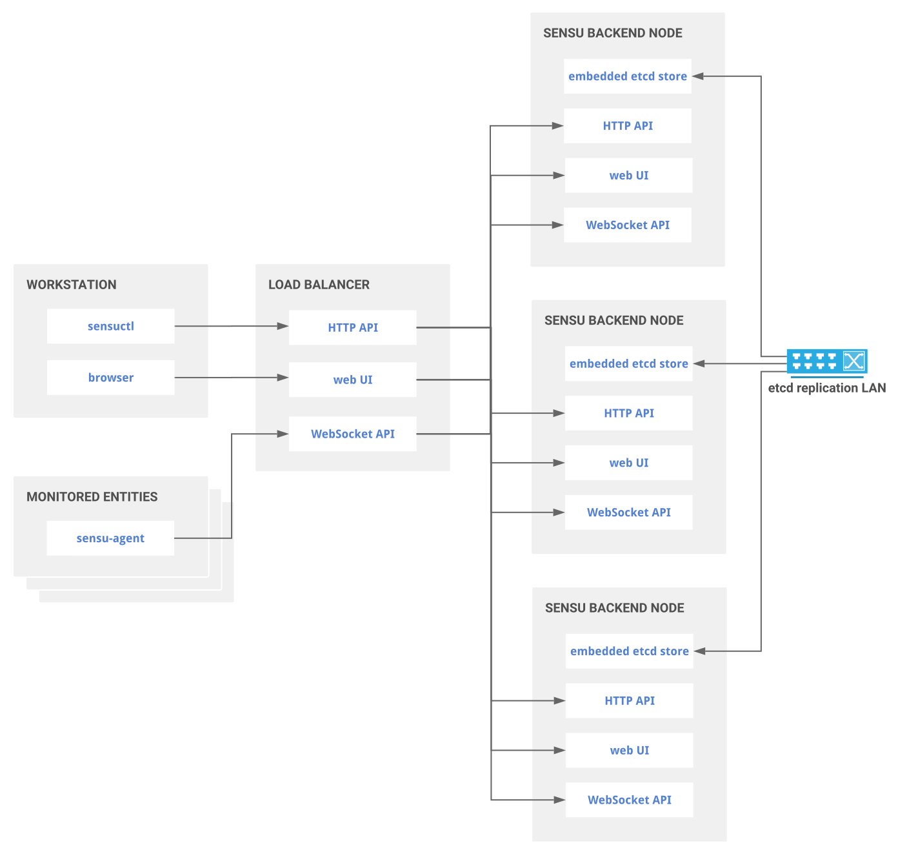

# SensuGo Cluster provisioning with Ansible and Terraform
Terraform templates for provisioning a sensu-go cluster with terraform and ansible

## Architecture



## Getting started

```
cd basic
cp terraform.tfvars.example terraform.tfvars
```

After doing the template copy above, you can now populate the variables as you wish.

```
terraform init
terraform apply
```

### Prerequisites

### Installing

## Deployment

Add additional notes about how to deploy this on a live system

## Built With

* [Terraform](https://www.terraform.io/) - Infrastructure provisioning
* [Ansible](https://www.ansible.com/) - Configuration Management

## Contributing


## Versioning


## Authors

* **David Linares** - *Initial work* - 
* **George Tarnaras** - *Initial work* - 

## License

This project is licensed under the MIT License - see the [LICENSE.md](LICENSE.md) file for details
